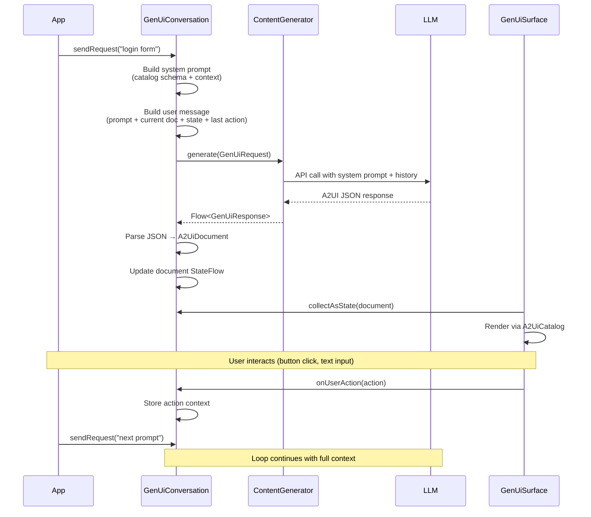

# Compose GenUI

Compose GenUI is a Jetpack Compose SDK that turns **natural-language prompts into native Android UIs** using an A2UI-inspired JSON format. Pass an API key, send a prompt, get a rendered UI — the SDK handles the agentic loop, conversation history, component catalog, and rendering.

> **A2UI alignment:** This SDK uses a tree-structured document model inspired by the [A2UI](https://a2ui.org) specification. It does not yet implement the v0.8 streaming JSONL protocol, message types (`surfaceUpdate`/`dataModelUpdate`/`beginRendering`), or JSON Pointer data binding. See [Roadmap](#roadmap) for protocol compliance plans.

Inspired by [Flutter GenUI](https://docs.flutter.dev/ai/genui) and the [A2UI](https://a2ui.org) initiative.

Repository: https://github.com/NikhilBhutani/compose-genui

## Quick Start

```kotlin
// 1. Pick a provider, pass your API key
val generator = GeminiContentGenerator(apiKey = "YOUR_KEY")

// 2. Create a conversation — SDK handles system prompt, history, agentic loop
val conversation = GenUiConversation(
    catalog = defaultGenUiCatalog(),
    contentGenerator = generator
)

// 3. Send a prompt
conversation.sendRequest("Show me a login form")

// 4. Render
GenUiSurface(conversation = conversation)
```

That's it. Four lines of setup.

## How It Works



### Agentic Loop

1. **Developer** calls `conversation.sendRequest(prompt)`
2. **GenUiConversation** builds a system prompt with the full component catalog schema, appends current document state, form values, and last user action as context
3. **ContentGenerator** sends the request to an LLM (Gemini, Claude, GPT, or Firebase AI)
4. **LLM** returns A2UI JSON describing the UI
5. **GenUiConversation** parses the JSON, updates `document: StateFlow<A2UiDocument?>`
6. **GenUiSurface** observes the StateFlow and renders native Compose UI
7. **User interactions** (button clicks, text input) are captured and fed back as context for the next request

## Architecture

```
┌─────────────────────────────────────────────────────┐
│                   Your App                          │
│  val generator = GeminiContentGenerator(apiKey)     │
│  val conversation = GenUiConversation(catalog,      │
│                       contentGenerator = generator) │
│  GenUiSurface(conversation = conversation)          │
└──────────────────────┬──────────────────────────────┘
                       │
┌──────────────────────▼──────────────────────────────┐
│              genui (single SDK module)                │
│                                                      │
│  GenUiConversation    ← orchestration facade         │
│  GenUiSurface         ← Composable binding           │
│  GenUiCatalog         ← unified schema + renderers   │
│  GenUiContentGenerator← pluggable LLM interface      │
│                                                      │
│  A2UiRender / A2UiSurface  ← low-level renderer     │
│  A2UiModels / A2UiJson     ← document model         │
│  A2UiSchema / A2UiValidator ← validation             │
│  builtins/ (60+ Material 3 components)               │
│                                                      │
│  llm/                                                │
│  ├── AnthropicContentGenerator                       │
│  ├── OpenAiContentGenerator                          │
│  └── GeminiContentGenerator                          │
│                                                      │
│  firebase/                                           │
│  └── FirebaseAiContentGenerator (optional dep)       │
└──────────────────────────────────────────────────────┘
```

## Modules

| Module | Description |
|--------|-------------|
| `genui` | The SDK — rendering, catalog, conversation, all LLM adapters (Anthropic, OpenAI, Gemini, Firebase AI) |
| `app` | Demo app with clean architecture (domain/data/presentation layers) |

## Content Generators

### Raw API (prototyping)

```kotlin
// Anthropic Claude
val generator = AnthropicContentGenerator(
    apiKey = "your-key",
    model = "claude-sonnet-4-5-20250929"  // default
)

// OpenAI GPT
val generator = OpenAiContentGenerator(
    apiKey = "your-key",
    model = "gpt-4o"  // default
)

// Google Gemini
val generator = GeminiContentGenerator(
    apiKey = "your-key",
    model = "gemini-2.0-flash"  // default
)
```

### Firebase AI (production)

No API key in app. Requires Firebase project setup.

`FirebaseAiContentGenerator` uses Firebase AI as a `compileOnly` dependency — it ships with the SDK but won't load unless you add Firebase to your app. Add to your `build.gradle.kts`:

```kotlin
// Required for FirebaseAiContentGenerator
implementation(platform("com.google.firebase:firebase-bom:34.8.0"))
implementation("com.google.firebase:firebase-ai")
```

Then use it:

```kotlin
// Google AI backend (free tier)
val generator = FirebaseAiContentGenerator(
    modelName = "gemini-2.0-flash",
    backend = GenerativeBackend.googleAI()
)

// Vertex AI backend (production billing)
val generator = FirebaseAiContentGenerator(
    modelName = "gemini-2.0-flash",
    backend = GenerativeBackend.vertexAI()
)
```

### Custom

Implement `GenUiContentGenerator` for any backend:

```kotlin
class MyCustomGenerator : GenUiContentGenerator {
    override fun generate(request: GenUiRequest): Flow<GenUiResponse> = flow {
        // Your logic here
        emit(GenUiResponse.UiDocument(jsonString))
        emit(GenUiResponse.Done)
    }
    override fun clearHistory() {}
}
```

## Usage with ViewModel

```kotlin
class ChatViewModel : ViewModel() {
    private val generator = GeminiContentGenerator(
        apiKey = BuildConfig.LLM_API_KEY
    )

    val conversation = GenUiConversation(
        catalog = defaultGenUiCatalog(),
        contentGenerator = generator,
        onError = { error -> /* handle */ },
        scope = viewModelScope
    )

    fun send(prompt: String) = conversation.sendRequest(prompt)
    fun reset() = conversation.reset()
}

@Composable
fun ChatScreen(vm: ChatViewModel) {
    // That's it — GenUiSurface observes conversation state and renders
    GenUiSurface(conversation = vm.conversation)
}
```

## Built-in Components (60+)

### Layout
`column`, `row`, `box`, `surface`, `card`, `elevatedCard`, `outlinedCard`, `spacer`, `divider`, `scaffold`, `scrollColumn`, `scrollRow`, `list`, `listRow`, `listItem`

### Input
`textfield`, `button`, `elevatedButton`, `tonalButton`, `textButton`, `outlinedButton`, `iconButton`, `filledIconButton`, `outlinedIconButton`, `iconToggleButton`, `checkbox`, `triStateCheckbox`, `radio`, `switch`, `slider`, `rangeSlider`, `stepper`, `segmentedButton`, `segment`, `searchBar`, `dropdown`, `option`

### Navigation
`topAppBar`, `centerTopAppBar`, `mediumTopAppBar`, `largeTopAppBar`, `bottomAppBar`, `navigationBar`, `navItem`, `navigationRail`, `railItem`, `navigationDrawer`, `drawerItem`, `tabs`, `tab`, `menu`, `menuItem`, `dialog`, `bottomSheet`, `bottomSheetScaffold`

### Feedback
`progress`, `snackbar`, `badge`, `fab`, `banner`, `tooltip`, `richTooltip`, `swipeToDismiss`

### Media & Display
`text`, `image`, `icon`, `avatar`, `listItemM3`

### Chips
`chip`, `filterChip`, `inputChip`, `suggestionChip`

### Paging & Pickers
`horizontalPager`, `verticalPager`, `page`, `datePicker`, `timePicker`

## Schema Validation

```kotlin
val result = validateA2Ui(document, options = A2UiValidationOptions(
    strict = true,
    checkIds = true,
    checkStructure = true,
    checkValues = true,
    checkIcons = true
))

if (!result.isValid) {
    result.errors.forEach { println("Error: ${it.message}") }
}
```

## Error Handling

Components render inside error boundaries. If a component throws, a fallback card is shown instead of crashing:

```kotlin
// Automatic — error boundaries wrap every component
A2UiRender(document, state, onEvent)
```

## Demo App

The demo app showcases the SDK with clean architecture:

```
app/
├── MainActivity.kt              ← setContent { DemoApp() }
├── DemoApp.kt                   ← theme + navigation + VM wiring
├── data/                        ← SettingsRepository, DemoSettings
├── domain/                      ← LlmConfig, CreateContentGeneratorUseCase
├── presentation/
│   ├── components/              ← M3 component showcase
│   ├── templates/               ← A2UI template rendering
│   ├── chat/                    ← ChatViewModel + GenUiSurface
│   └── settings/                ← Provider picker, API key, model
└── ui/                          ← Theme, colors, reusable composables
```

## Tech Stack

| Dependency | Version |
|---|---|
| Kotlin | 2.1.10 |
| Compose BOM | 2025.01.01 |
| compileSdk / targetSdk | 35 |
| minSdk | 24 |
| Firebase BOM | 34.8.0 |
| OkHttp | 4.12.0 |
| Coil | 3.1.0 |
| kotlinx-serialization | 1.7.3 |

## Getting Started

**Requirements:** Android Studio, SDK 35+, Kotlin 2.1+, JDK 17+

```bash
./gradlew build               # Build all modules
./gradlew test                # Run unit tests
./gradlew :app:installDebug   # Install demo app
```

## Comparison with Flutter GenUI

| | Flutter GenUI | Compose GenUI |
|---|---|---|
| **Orchestration** | `GenUiConversation` | `GenUiConversation` |
| **Rendering** | `GenUiSurface` | `GenUiSurface` |
| **Catalog** | `Catalog` + `CatalogItem` | `GenUiCatalog` + `GenUiCatalogItem` |
| **LLM interface** | `ContentGenerator` | `GenUiContentGenerator` |
| **Firebase** | `genui_firebase_ai` package | `genui-firebase` module |
| **Raw Gemini** | `genui_google_generative_ai` package | `GeminiContentGenerator` (built-in) |
| **Additional providers** | — | `AnthropicContentGenerator`, `OpenAiContentGenerator` |
| **State** | `DataModel` | `A2UiState` via `StateFlow` |
| **UI format** | A2UI JSON | A2UI JSON |

## Roadmap

### Done
- [x] 60+ Material 3 components
- [x] Multi-provider LLM support (Anthropic, OpenAI, Gemini)
- [x] Firebase AI content generator
- [x] Orchestration facade (GenUiConversation)
- [x] Composable surface binding (GenUiSurface)
- [x] Schema validation
- [x] Error boundaries
- [x] CI (GitHub Actions)
- [x] Maven publish configuration

### A2UI Protocol Compliance
- [ ] Streaming JSONL format with incremental updates
- [ ] Message types: `surfaceUpdate`, `dataModelUpdate`, `beginRendering`, `deleteSurface`
- [ ] Adjacency-list component model (flat list with ID references)
- [ ] JSON Pointer data binding (`/path/to/value`)
- [ ] DataModel reactive state store

### SDK Enhancements
- [ ] Multi-surface support (one conversation, multiple surfaces)
- [ ] Transport integrations (A2A, AG-UI, SSE, WebSockets)
- [ ] More unit tests

## Contributing

Contributions welcome. Please open an issue or PR. If adding components, include schema updates, catalog entry, and demo usage.

## License

MIT License. See `LICENSE`.

## Maintainers

- Nikhil Bhutani

## Acknowledgements

Inspired by [Flutter GenUI](https://docs.flutter.dev/ai/genui) and the [A2UI](https://a2ui.org) initiative.
